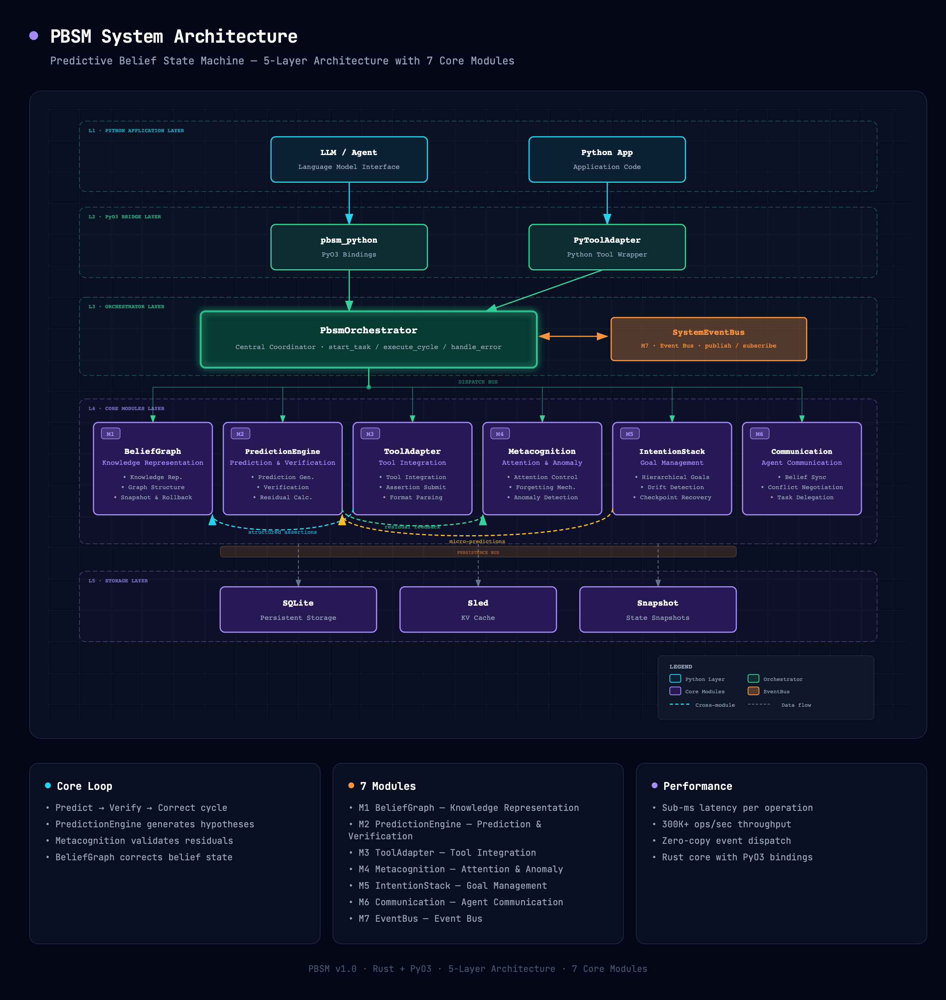
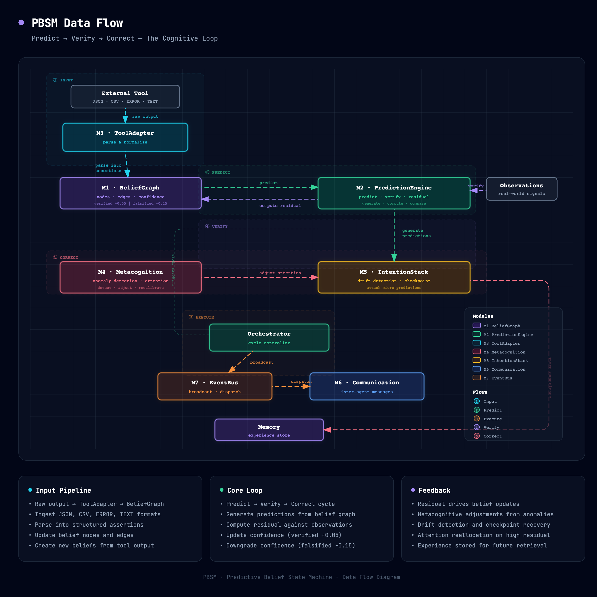

# PBSM - Predictive Belief State Machine

[](https://www.rust-lang.org/)
[](https://www.python.org/)
[](LICENSE)
[]()

> A cognitive architecture that predicts before it acts, continuously refining its beliefs through verification and feedback loops.

***

- [中文文档](README_zh.md)

## Why PBSM?

### Problem Statement

Current AI Agent systems universally adopt an **"Act-then-Observe"** paradigm: the Agent calls a tool, gets a result, then decides the next step. This pattern has fundamental flaws:

1. **Cannot anticipate consequences**: The Agent has no expectation of results before executing an action, and cannot detect potential problems in advance. For example, a code-modification Agent might execute `rm -rf` without predicting that files will be permanently deleted.
2. **Lack of self-awareness**: The system doesn't know what it "doesn't know." When excessive focus, drift, or oscillation occurs, the system cannot self-detect and self-correct.
3. **Unstructured beliefs**: Traditional Agents store information in a flat context window, lacking structured knowledge representation. There are no causal, temporal, or hierarchical relationships between pieces of information, limiting reasoning capability.
4. **Unreliable memory**: Without a layered memory mechanism (short-term / long-term / experiential), Agents cannot learn from past successes and failures, starting from scratch with every interaction.
5. **Fragile task planning**: Simple task queues cannot handle hierarchical goals, intent drift, and checkpoint recovery. Once a step fails, the entire task chain collapses.

PBSM's core insight comes from cognitive science: **humans predict outcomes before acting, and when predictions don't match reality, they revise their beliefs and adjust their behavior**. PBSM formalizes this cognitive loop into a computable architecture.

### How PBSM Solves It

PBSM introduces a **"Predict → Verify → Correct"** closed-loop paradigm:

| Traditional Agent                         | PBSM Agent                                                 |
| ----------------------------------------- | ---------------------------------------------------------- |
| Execute → Observe → React                 | Predict → Execute → Verify → Correct                       |
| No expectations, remediate after the fact | Has expectations, prevents problems proactively            |
| Flat context window                       | Structured Belief Graph                                    |
| No self-monitoring                        | Metacognition (attention / forgetting / anomaly detection) |
| Simple task queue                         | Hierarchical Intention Stack + checkpoint recovery         |
| No long-term memory                       | Three-layer memory (raw logs / snapshots / experience)     |
| Single Agent                              | Multi-Agent communication + conflict negotiation           |

**Core difference**: A PBSM Agent generates a structured Prediction before every action, describing "what I expect to happen." After execution, the Verifier computes the residual between prediction and reality, and the residual drives belief updates and behavioral adjustments. This gives the Agent:

- **Anticipation**: Evaluate risks and expected benefits before acting
- **Explainability**: Every decision has a prediction as its basis — "why this action" is traceable
- **Adaptability**: Residual feedback drives continuous learning; beliefs are refined with experience
- **Robustness**: Metacognition automatically detects anomalous patterns (oscillation, drift, excessive focus) and triggers interventions
- **Nativeness**: PBSM does not rely on any LLM or Agent. You can entirely treat it as a standalone self-evolving system

***

## Design Philosophy

### Why "Predict Before Act"?

PBSM's core paradigm is inspired by the following theories:

- **Predictive Coding**: Neuroscience theory posits that the brain doesn't passively receive information but continuously predicts sensory input, using prediction error to drive learning. PBSM's residual computation is an engineering implementation of this theory.
- **Active Inference**: Friston's Free Energy Principle states that intelligent systems act by minimizing prediction error. PBSM's closed-loop design (Predict → Verify → Correct) directly corresponds to this principle.
- **Belief Revision**: Belief revision theory in cognitive science provides a formal framework — when new evidence conflicts with old beliefs, beliefs should be revised with minimal cost. PBSM's confidence adjustment (verification pass +0.05, verification fail -0.15) embodies an asymmetric revision strategy.

### Why Belief Graph?

| Feature                | Knowledge Graph     | Belief Graph                                                                    |
| ---------------------- | ------------------- | ------------------------------------------------------------------------------- |
| Core semantics         | "X is true"         | "X has confidence 0.85"                                                         |
| Uncertainty            | Usually not handled | First-class citizen (confidence field)                                          |
| Temporality            | Mostly static       | Dynamic (create/update timestamps + validity window)                            |
| Forgettability         | No such concept     | Built-in forgetting mechanism (low-value beliefs auto-evicted)                  |
| Snapshot & rollback    | Not supported       | Supported (Snapshot + Checkpoint)                                               |
| Prediction association | None                | Edges can be associated with predictions; confidence updates after verification |

The core advantage of a Belief Graph: **every node and edge carries a confidence score**, enabling the system to quantify "how certain" rather than merely "what is known." When a prediction is verified or falsified, the confidence of related beliefs is automatically adjusted — something traditional knowledge graphs cannot do.

### Why Built-in Metacognition?

Metacognition is the key design that distinguishes PBSM from other Agent frameworks. An Agent without metacognition is like a system that cannot realize it's making mistakes:

- **Attention control**: Simulates the limited nature of human attention. The system can switch between `LowVigilance`, `ModerateFocus`, and `HighReconnaissance` modes, avoiding over-investment in a single target or excessively scattered attention.
- **Forgetting mechanism**: Not all information is worth retaining forever. The ForgettingExecutor identifies low-value beliefs based on Value Evaluation, supporting deferred forgetting and protected beliefs to prevent critical information from being accidentally deleted.
- **Anomaly detection**: Automatically detects four anomalous patterns — Oscillation, Locked, Excessive Focus, and Drift — and triggers Interventions. This gives the system the ability to "know when something is wrong with itself."

### Why Intention Stack?

The Intention Stack design is inspired by the BDI (Belief-Desire-Intention) architecture:

- **Hierarchical goals**: Supports nested intentions (main goals containing sub-goals), each with independent plan steps
- **Drift detection**: Automatically evaluates whether current execution has deviated from the original intent, supporting corrective actions
- **Checkpoint recovery**: Any level can create a checkpoint; on failure, roll back to the nearest stable state
- **Micro-predictions**: Each intention can be associated with a micro-prediction, verified before proceeding

### Why Rust?

| Consideration       | Rust's Advantage                                                                                            |
| ------------------- | ----------------------------------------------------------------------------------------------------------- |
| Performance         | Zero-cost abstractions; belief graph queries and prediction generation complete in microseconds             |
| Concurrency safety  | Compile-time guarantee of data-race freedom; `Arc<RwLock>` pattern naturally suits read-heavy belief graphs |
| Reliability         | No null pointers, no data races, no undefined behavior; 545+ tests with zero unsafe code                    |
| Python interop      | PyO3 provides zero-copy Rust-Python bridging, balancing performance and usability                           |
| Embedded deployment | Compiles to a single binary, suitable for Docker/K8s deployment with no runtime dependencies                |

***

## Overview

PBSM (Predictive Belief State Machine) is a cognitive architecture framework based on a Belief Graph. The core design principle is the **Predict → Verify → Correct** closed loop:

1. **Input**: External tools produce data, which is parsed into structured assertions via ToolAdapter and updates the Belief Graph
2. **Prediction**: PredictionEngine generates predictions based on the Belief Graph
3. **Execution**: Orchestrator coordinates all modules to execute the system cycle
4. **Verification**: Prediction results are verified; deviations update beliefs and drive the next round of predictions

### Seven Core Modules

| Module | Name             | Responsibility                                                                           |
| ------ | ---------------- | ---------------------------------------------------------------------------------------- |
| M1     | BeliefGraph      | Belief Graph — knowledge representation, graph structure management, snapshot & rollback |
| M2     | PredictionEngine | Prediction Engine — generate and verify predictions based on the Belief Graph            |
| M3     | ToolAdapter      | Tool Adapter — external tool integration, assertion submission                           |
| M4     | Metacognition    | Metacognition — attention modes, forgetting mechanism, anomaly detection                 |
| M5     | IntentionStack   | Intention Stack — task planning, hierarchical management, checkpoint recovery            |
| M6     | Communication    | Communication — cross-Agent coordination, security filtering                             |
| M7     | EventBus         | Event Bus — system event dispatching, publish/subscribe, history management              |

***

## Architecture

### Layered Architecture



📊 [View Full Architecture Diagram](docs/architecture_en.html)

The system uses a five-layer architecture: Python Application Layer → PyO3 Bridge Layer → Orchestrator Layer → Core Module Layer (M1–M6) → Storage Layer (SQLite/Sled/Snapshot). See the architecture diagram for details.

### Data Flow



📊 [View Data Flow Diagram](docs/dataflow_en.html)

### Deployment Topology

📊 [View Deployment Diagram](docs/deployment_en.html)

***

## Quick Start

### Prerequisites

- **Rust** 1.75+ (1.80+ recommended)
- **Python** 3.13+ (tested on 3.13)
- **maturin** ≥ 1.0 (for building the Python wheel)

### Build Rust Core

```bash
git clone <repo-url> && cd pbsm

cargo build --release
cargo test --workspace

cargo clippy --workspace -- -D warnings
```

### Build Python Wheel

```bash
python3.13 -m venv .venv313
source .venv313/bin/activate

pip install maturin

cd crates/pbsm-python
VIRTUAL_ENV=$(echo $VIRTUAL_ENV) \
PATH="$VIRTUAL_ENV/bin:$PATH" \
PYO3_USE_ABI3_FORWARD_COMPATIBILITY=1 \
maturin develop --release

python -c "from pbsm_python import PyPbsmOrchestrator; print('OK')"
```

### Install Python Adapter

```bash
cd adapters/tool_adapter
pip install -e .
```

***

## Python API Reference

The `pbsm_python` native module exposes the following PyO3 methods on `PyPbsmOrchestrator`:

### Belief Graph Operations

| Method                   | Signature                                                                                                  | Description                                                                                                                                             |
| ------------------------ | ---------------------------------------------------------------------------------------------------------- | ------------------------------------------------------------------------------------------------------------------------------------------------------- |
| `create_belief`          | `create_belief(node_type, name, attributes_json?, source?, source_type?, tags_json?, initial_confidence?)` | Create a belief node in the graph. `node_type` and `name` are required; all other parameters are optional. Returns the created belief's ID and details. |
| `create_edge`            | `create_edge(edge_type, source_id, target_id, confidence)`                                                 | Create a belief edge connecting two nodes. `edge_type` describes the relationship; `confidence` sets the edge's initial confidence score.               |
| `query_beliefs`          | `query_beliefs(query_json)`                                                                                | Query beliefs using a JSON filter. Supports `node_type`, `name_contains`, `tags`, `min_confidence`, and `limit` filters.                                |
| `get_belief`             | `get_belief(belief_id)`                                                                                    | Retrieve a single belief's full details by its ID.                                                                                                      |
| `get_belief_graph_stats` | `get_belief_graph_stats()`                                                                                 | Get aggregate statistics about the belief graph (node count, edge count, etc.).                                                                         |

### Intention Stack Operations

| Method                      | Signature                                | Description                                                                                                                                        |
| --------------------------- | ---------------------------------------- | -------------------------------------------------------------------------------------------------------------------------------------------------- |
| `push_intention`            | `push_intention(description, priority?)` | Push a new intention onto the stack. `description` is required; `priority` is optional.                                                            |
| `pop_intention`             | `pop_intention()`                        | Pop the top-level intention from the stack (LIFO semantics). After a pop, the system automatically recomputes remaining nodes' levels and indices. |
| `get_intention_stack_state` | `get_intention_stack_state()`            | Get the current state of the intention stack, including all active intentions and their hierarchy.                                                 |

### Metacognition & Monitoring

| Method                 | Signature                        | Description                                                                                                                                   |
| ---------------------- | -------------------------------- | --------------------------------------------------------------------------------------------------------------------------------------------- |
| `get_attention_status` | `get_attention_status()`         | Get the current attention mode and parameters (LowVigilance / ModerateFocus / HighReconnaissance).                                            |
| `detect_anomalies`     | `detect_anomalies(window_size?)` | Run anomaly detection over the specified window. Detects oscillation, drift, excessive focus, and locked patterns. `window_size` is optional. |
| `get_event_history`    | `get_event_history(limit?)`      | Retrieve recent events from the EventBus history. `limit` controls the maximum number of events returned.                                     |

### Usage Example

```python
from pbsm_python import PyPbsmOrchestrator, PyPbsmConfig

config = PyPbsmConfig('{"graph": {"maxNodes": 2000}}')
orchestrator = PyPbsmOrchestrator(config)

# Create beliefs
belief = orchestrator.create_belief(
    node_type="entity",
    name="server-prod-01",
    attributes_json='{"cpu": 92, "memory": 85}',
    source="monitor_api",
    source_type="tool",
    tags_json='["production", "infrastructure"]',
    initial_confidence=0.9
)

# Create an edge between beliefs
edge = orchestrator.create_edge(
    edge_type="depends_on",
    source_id=belief["id"],
    target_id="belief-002",
    confidence=0.8
)

# Query beliefs
results = orchestrator.query_beliefs('{"node_type": "entity", "min_confidence": 0.7}')

# Intention stack
orchestrator.push_intention("Investigate CPU spike on prod-01", priority=0.9)
state = orchestrator.get_intention_stack_state()
orchestrator.pop_intention()

# Metacognition
attention = orchestrator.get_attention_status()
anomalies = orchestrator.detect_anomalies(window_size=50)
events = orchestrator.get_event_history(limit=20)
```

***

## When to Use PBSM?

PBSM is suitable for the following scenarios:

| Scenario                                                 | Why PBSM                                                                                             |
| -------------------------------------------------------- | ---------------------------------------------------------------------------------------------------- |
| LLM/Agent needs to evaluate risks before acting          | PBSM's prediction mechanism lets the Agent "think before it acts," avoiding irreversible operations  |
| Agent needs long-term memory and experience accumulation | Three-layer memory (raw logs / snapshots / experience) lets the Agent learn from history             |
| Multi-step tasks require planning and rollback           | Intention Stack supports hierarchical goals, drift detection, checkpoint recovery                    |
| Agent needs self-monitoring and self-correction          | Metacognition automatically detects oscillation / drift / excessive focus and triggers interventions |
| Multiple Agents need to share beliefs and coordinate     | Communication module provides belief synchronization, conflict negotiation, security filtering       |
| Explainable Agent decisions are required                 | Every decision has a prediction basis; "why this action" is traceable                                |

**Not suitable for**: Simple single-turn Q\&A, stateless tool calls that don't need memory, pure computation tasks.

***

## How to Integrate with LLM/Agent

### Core Interaction Model

📊 [View Integration Diagram](docs/integration_en.html)

PBSM's interaction with LLM/Agent follows the **Predict → Execute → Verify → Correct** closed loop:

1. LLM calls a tool and gets raw output
2. Raw output is passed to ToolAdapter, which parses it into structured assertions
3. Assertions are submitted to the PBSM core, updating the Belief Graph
4. PBSM generates predictions based on the Belief Graph
5. After the LLM executes an action, it feeds observations back to PBSM for verification
6. Verification residuals drive belief correction and return diagnostic results to the LLM

**What the LLM/Agent provides**: Raw tool output (JSON/HTML/CSV/TEXT/ERROR)
**What the LLM/Agent receives**: Structured assertions + predictions + verification results + diagnostic information

### Scenario 1: Code Analysis Agent

An LLM Agent analyzes a codebase, needing to understand code structure, remember historical findings, and predict the impact of modifications.

```python
from pbsm_tool_adapter import ToolAdapter, RawOutput

adapter = ToolAdapter(pbsm_config_json='{"graph": {"maxNodes": 2000}}')

# Step 1: LLM calls code analysis tool, gets JSON output
# (This step is done by the LLM/Agent framework, e.g., calling grep, AST analyzer, etc.)
tool_output = '{"findings": [{"file": "src/main.rs", "type": "function", "name": "process", "complexity": 12}]}'

# Step 2: Pass tool output to PBSM for parsing
# Input: raw tool output → Output: list of structured assertions
raw = RawOutput(content=tool_output, content_type="application/json")
parsed = adapter.parse_tool_output(raw_output=raw, tool_id="code_analyzer")

# parsed.assertions contains structured assertions, e.g.:
# [
#   StructuredAssertion(
#     assertion_type=ENTITY_ATTRIBUTE,
#     subject=AssertionSubject(entity_type="function", entity_id="src/main.rs::process"),
#     predicate="has_complexity",
#     object=AssertionObject(value=12, value_type=NUMBER),
#     confidence=ConfidenceInfo(score=0.9, method=EXTRACTED)
#   )
# ]

# Step 3: Submit assertions to PBSM core, updating the Belief Graph
# Input: assertion list → Output: submission result (which were accepted)
submit_result = adapter.submit_to_core(parsed.assertions)
# {"status": "ok", "accepted": 3, "assertion_ids": [...]}

# Step 4: Start a PBSM task, initiating the prediction loop
# Input: task description → Output: task creation result
task = adapter.start_task("Refactor high-complexity functions")
# {"status": "ok", "description": "Refactor high-complexity functions", ...}

# Step 5: Execute a system cycle, get current state
# Input: none → Output: attention mode, active prediction count, pending forget count
cycle = adapter.execute_cycle()
# {"attention_mode": "MODERATE_FOCUS", "active_predictions": 2, "pending_forget_count": 0}

# Step 6: After LLM executes an action, verify predictions
# Input: prediction ID + actual observations → Output: verification result (residual, confidence change)
verify = adapter.verify_prediction(
    prediction_id="pred_001",
    observations=[{"actual_complexity": 8, "refactored": True}],
)
# {"status": "verified", "residual": 0.33, "confidence_change": +0.05}

# Step 7: If an error occurs, notify PBSM to trigger intervention
# Input: error description + severity level → Output: anomaly count, whether intervention was applied
error = adapter.handle_pbsm_error("Tests failed after refactoring", "high")
# {"anomaly_count": 1, "intervention_applied": True}
```

### Scenario 2: Infrastructure Monitoring Agent

An LLM Agent monitors server status, needing to remember historical metrics, predict anomalies, and coordinate multiple Agents.

```python
from pbsm_tool_adapter import ToolAdapter, RawOutput

adapter = ToolAdapter(pbsm_config_json='{"graph": {"maxNodes": 5000}}')

# LLM calls monitoring API, gets server metrics
metrics_json = '{"server": "prod-01", "cpu": 92, "memory": 85, "disk_io": 3400}'

# Parse and submit to Belief Graph
raw = RawOutput(content=metrics_json, content_type="application/json")
parsed = adapter.parse_tool_output(raw_output=raw, tool_id="monitor_api")
adapter.submit_to_core(parsed.assertions)

# PBSM generates predictions based on historical beliefs
# e.g., predicts CPU will exceed 95% within 10 minutes
cycle = adapter.execute_cycle()
# {"attention_mode": "HIGH_RECONNAISSANCE", "active_predictions": 3, ...}
# Attention automatically switches to high reconnaissance mode

# After LLM executes a scale-out operation, verify predictions
verify = adapter.verify_prediction(
    prediction_id="pred_cpu_spike",
    observations=[{"cpu_after_scaleout": 45}],
)
# Prediction "CPU will exceed 95%" doesn't match actual "CPU 45% after scale-out"
# → Large residual → Belief correction: scale-out is effective → Next prediction will account for scale-out capability

# Check current Belief Graph state
stats = adapter.get_belief_graph_stats()
# {"node_count": 47, "edge_count": 132, "has_memory_store": False}
```

### Scenario 3: Rust Embedded Integration

If your Agent framework is written in Rust, you can use the core API directly:

```rust
use pbsm_core::{PbsmConfig, PbsmOrchestrator, AnomalySeverity};

#[tokio::main]
async fn main() -> Result<(), Box<dyn std::error::Error>> {
    let config = PbsmConfig::default();
    let orchestrator = PbsmOrchestrator::new(config);

    // Agent submits a task
    let task = orchestrator.start_task("Analyze codebase structure".to_string(), None).await?;

    // Execute predict-verify cycle
    let cycle = orchestrator.execute_cycle().await?;
    // cycle.attention_mode → current attention mode
    // cycle.active_predictions → number of active predictions

    // When Agent encounters an error, notify the metacognitive system
    let error_result = orchestrator.handle_error(
        "API timeout".to_string(),
        AnomalySeverity::High,
    )?;
    // error_result.anomaly_count → number of detected anomalies
    // error_result.intervention_applied → whether automatic intervention was applied

    // Diagnostics: consistency check + memory footprint
    let report = orchestrator.consistency_check();
    let footprint = orchestrator.memory_footprint();

    Ok(())
}
```

### Data Flow Summary

| Step              | LLM/Agent Input                    | PBSM Output                                                | Description                                                 |
| ----------------- | ---------------------------------- | ---------------------------------------------------------- | ----------------------------------------------------------- |
| Parse tool output | `RawOutput` (raw text + format)    | `ParseResult` (structured assertion list)                  | Auto-detect format, extract entities/relations/events       |
| Submit assertions | `list[StructuredAssertion]`        | `{"status", "accepted", "assertion_ids"}`                  | Assertions update the Belief Graph                          |
| Start task        | Task description string            | `{"status", "description"}`                                | Creates a new intention in the Intention Stack              |
| Execute cycle     | None                               | `{"attention_mode", "active_predictions", ...}`            | Triggers prediction generation and metacognitive evaluation |
| Verify prediction | Prediction ID + observations       | `{"status", "residual", "confidence_change"}`              | Residual drives belief correction                           |
| Error handling    | Error description + severity level | `{"anomaly_count", "intervention_applied"}`                | Triggers metacognitive intervention                         |
| Diagnostics       | None                               | Belief Graph stats / consistency report / memory footprint | For operational monitoring                                  |

***

## Multi-Agent Support

PBSM natively supports multi-Agent collaboration through the M6 Communication module. Each Agent has its own `PbsmOrchestrator` instance (independent Belief Graph, Intention Stack, Metacognition) and coordinates through the Communication module.

### Multi-Agent Architecture

📊 [View Multi-Agent Diagram](docs/multi-agent_en.html)

Each Agent has its own `PbsmOrchestrator` instance (independent Belief Graph, Intention Stack, Metacognition), coordinating through the M6 Communication module. The Communication module includes: SyncManager (belief synchronization), ConflictDetector (conflict detection), NegotiationHandler (conflict negotiation), DelegationManager (task delegation), with AccessController and SensitiveDataFilter providing security at the base layer.

### Core Capabilities

| Capability             | Module                | Description                                                                                             |
| ---------------------- | --------------------- | ------------------------------------------------------------------------------------------------------- |
| Belief synchronization | `SyncManager`         | Synchronize Belief Graph snapshots between Agents; supports incremental and full sync                   |
| Conflict detection     | `ConflictDetector`    | Detect attribute inconsistency, relation inconsistency, intent conflict, confidence conflict            |
| Conflict negotiation   | `NegotiationHandler`  | Resolve conflicts through proposal-counterproposal mechanism; supports automatic and manual negotiation |
| Task delegation        | `DelegationManager`   | Delegate sub-tasks to other Agents; supports quality standards and timeout control                      |
| Access control         | `AccessController`    | Role-based (Coordinator/Collaborator/Observer/Worker) permission management                             |
| Data filtering         | `SensitiveDataFilter` | Automatically filter/redact sensitive fields when sharing snapshots                                     |

### Multi-Agent Usage Notes

1. **Each Agent has an independent instance**: Each Agent should create its own `PbsmOrchestrator`, avoiding shared-state concurrency issues. Belief synchronization is done through the Communication module, not shared memory.
2. **Roles and permissions**: The Communication module defines 4 roles — `Coordinator`, `Collaborator`, `Observer`, `Worker`. Different roles have different read/write/delete/share/delegate permissions for resources (Snapshot/Belief/Relation/Intent/Prediction).
3. **Conflict handling strategies**: When multiple Agents have different beliefs about the same thing:
   - `AttributeMismatch`: Attribute values disagree (e.g., Agent A believes CPU=92%, Agent B believes CPU=88%)
   - `RelationMismatch`: Relations disagree (e.g., causal chain divergence)
   - `IntentMismatch`: Intent conflicts (e.g., two Agents simultaneously modifying the same file)
   - `ValueConfidenceConflict`: Confidence conflicts (same fact, different confidence levels)
4. **Sensitive data filtering**: Before sharing snapshots, you must configure `SensitiveDataFilter`, which supports 4 filtering actions:
   - `Remove`: Remove the field
   - `Redact`: Replace with `[REDACTED]`
   - `Mask`: Partial masking (e.g., `192.168.***.***`)
   - `Reject`: Reject the entire snapshot
5. **Sync performance**: Belief synchronization involves 5 stages: snapshot construction → compression → transmission → verification → fusion. For large-scale Belief Graphs (>1000 nodes), incremental sync (`SyncRequestType::Incremental`) is recommended over full sync.
6. **Current limitations**: The multi-Agent Communication module is currently implemented only at the Rust core layer and has not yet been exposed to Python bindings. Python users who need multi-Agent functionality must use the Rust API directly or wait for a future Python binding update.

***

## Configuration Management

```python
from pbsm_python import PyPbsmConfig

# Load from TOML file
config = PyPbsmConfig("/path/to/config.toml")

# Load from JSON file
config = PyPbsmConfig("/path/to/config.json")

# Create from JSON string
config = PyPbsmConfig('{"graph": {"maxNodes": 2000}}')

# Validate configuration
config.validate()  # Invalid config raises ValueError

# Read/modify configuration attributes
print(config.graph_max_nodes)    # 2000
config.graph_max_nodes = 5000    # Modify
print(config.graph_max_edges)    # 10000
config.graph_max_edges = 20000

# Serialize
json_str = config.to_json()      # Output JSON string
config.save("/path/to/output.toml")  # Save as TOML
config.save("/path/to/output.json")  # Save as JSON
```

### Rust: Configuration File Loading

```rust
use pbsm_core::orchestrator::PbsmConfig;
use std::path::Path;

// Load from TOML file
let config = PbsmConfig::load_from_toml(Path::new("config.toml"))?;

// Load from JSON file
let config = PbsmConfig::load_from_json(Path::new("config.json"))?;

// Create from JSON string
let config = PbsmConfig::from_json_str(r#"{"graph": {"maxNodes": 2000}}"#)?;

// Validate
config.validate()?;

// Save
config.save_to_toml(Path::new("output.toml"))?;
config.save_to_json(Path::new("output.json"))?;
```

***

## Configuration Reference

### Complete TOML Configuration Example

```toml
[graph]
maxNodes = 500
maxEdges = 2000
defaultConfidence = 0.5

[intention_stack]
max_stack_depth = 20
max_stack_capacity = 500
max_revert_depth = 5
root_visibility_threshold = 0.6
default_step_timeout = 30000
default_max_retries = 3
max_checkpoints_per_layer = 20

[intention_stack.drift_threshold]
warning = 0.3
moderate = 0.5
severe = 0.7
critical = 0.9

[metacognitive.attention]
min_attention = 0.1
max_attention = 1.0
default_attention = 0.5
decay_rate = 0.05
boost_step = 0.4
time_decay_rate = 0.001
max_adjustment = 0.3
min_adjustment_interval_ms = 100

[metacognitive.attention.weight_configuration]
goal_relevance_weight = 0.35
access_frequency_weight = 0.25
recency_weight = 0.20
residual_weight = 0.20

[metacognitive.value_evaluation]
recency_decay_lambda = 0.05
access_window_size = 50
max_access_threshold = 10

[metacognitive.forgetting]
forget_threshold = 0.2
max_active_beliefs = 500
min_survival_steps = 10
forget_cooldown_steps = 20
max_defer_steps = 200
batch_forgive_interval = 50
residual_defer_threshold = 0.7

[metacognitive.anomaly_detection]
coverage_threshold = 0.3
oscillation_threshold = 5
drift_threshold = 0.2
lock_threshold = 100
anomaly_check_interval = 25
anomaly_history_size = 100

[memory]
storage_path = "./data/memory"
cache_size = 100
max_log_age_days = 90
compression_type = "Lz4"
max_recent_sessions = 30
base_confidence_threshold = 0.4
cleanup_auto_trigger_threshold = 0.85
retrieval_default_limit = 20
importance_retention_bonus = 1.5
archive_threshold_days = 30
```

### Configuration Fields

| Section                           | Field                            | Type    | Default         | Description                                                                                       |
| --------------------------------- | -------------------------------- | ------- | --------------- | ------------------------------------------------------------------------------------------------- |
| `graph`                           | `maxNodes`                       | usize   | 500             | Maximum number of belief graph nodes                                                              |
| `graph`                           | `maxEdges`                       | usize   | 2000            | Maximum number of belief graph edges                                                              |
| `graph`                           | `defaultConfidence`              | f64     | 0.5             | Default confidence for new nodes                                                                  |
| `intention_stack`                 | `max_stack_depth`                | usize   | 20              | Maximum intention stack depth                                                                     |
| `intention_stack`                 | `max_stack_capacity`             | usize   | 500             | Maximum intention stack capacity                                                                  |
| `intention_stack`                 | `max_revert_depth`               | usize   | 5               | Maximum revert depth                                                                              |
| `metacognitive.attention`         | `default_attention`              | f64     | 0.5             | Default attention parameter (≤0.3 LowVigilance / 0.3–0.7 ModerateFocus / >0.7 HighReconnaissance) |
| `metacognitive.attention`         | `min_attention`                  | f64     | 0.1             | Attention lower bound                                                                             |
| `metacognitive.attention`         | `max_attention`                  | f64     | 1.0             | Attention upper bound                                                                             |
| `metacognitive.forgetting`        | `forget_threshold`               | f64     | 0.2             | Forgetting threshold (beliefs below this value are evicted)                                       |
| `metacognitive.forgetting`        | `max_active_beliefs`             | usize   | 500             | Maximum number of active beliefs                                                                  |
| `metacognitive.anomaly_detection` | `coverage_threshold`             | f64     | 0.3             | Anomaly coverage threshold                                                                        |
| `metacognitive.anomaly_detection` | `oscillation_threshold`          | usize   | 5               | Oscillation detection threshold (consecutive adjustment count)                                    |
| `memory`                          | `storage_path`                   | PathBuf | "./data/memory" | Storage directory path                                                                            |
| `memory`                          | `cache_size`                     | usize   | 100             | Cache size                                                                                        |
| `memory`                          | `max_log_age_days`               | u32     | 90              | Maximum log retention days                                                                        |
| `memory`                          | `compression_type`               | enum    | Lz4             | Compression algorithm (NONE/LZ4/ZSTD)                                                             |
| `memory`                          | `base_confidence_threshold`      | f64     | 0.4             | Base confidence threshold                                                                         |
| `memory`                          | `cleanup_auto_trigger_threshold` | f64     | 0.85            | Auto-cleanup trigger threshold                                                                    |

***

## Deployment

### Docker Build

```bash
# Build image
docker build -t pbsm-server .

# Run locally
docker run -p 8080:8080 \
  -v $(pwd)/data:/pbsm/data \
  -e RUST_LOG=info \
  pbsm-server
```

### Kubernetes (kind) Deployment

```bash
# Load image into kind cluster
kind load docker-image pbsm-server:latest

# Apply configuration
kubectl apply -f k8s/configmap.yaml
kubectl apply -f k8s/deployment.yaml

# Check status
kubectl get pods -l app=pbsm-server
kubectl logs -f deployment/pbsm-server

# Port forward (local testing)
kubectl port-forward svc/pbsm-server 8080:8080
```

***

## Benchmarks

The project includes 11 criterion benchmark groups covering all core hot paths:

| Benchmark Group                       | What It Tests                           |
| ------------------------------------- | --------------------------------------- |
| `belief_graph/create_belief`          | Belief node creation (10/100/500 nodes) |
| `belief_graph/query_by_type`          | Query by type                           |
| `belief_graph/query_by_tag`           | Query by tag                            |
| `event_bus/publish`                   | Event publishing (64/256/1024 capacity) |
| `event_bus/subscribe_receive`         | Subscribe and receive                   |
| `metacognitive/attention`             | Attention state query                   |
| `metacognitive/anomaly_detection`     | Anomaly detection                       |
| `orchestrator/execute_cycle`          | Execute cycle                           |
| `orchestrator/start_task`             | Start task                              |
| `prediction_engine/create_prediction` | Create prediction                       |
| `config/serialization`                | TOML/JSON serialization                 |

```bash
# Run benchmarks
cargo bench --bench pbsm_benchmarks

# Reports generated in target/criterion/
```

***

## Important Notes

### Python 3.14+ Compatibility

PyO3 0.22 officially supports up to Python 3.13. When using Python 3.14+, you **must** set the environment variable:

```bash
export PYO3_USE_ABI3_FORWARD_COMPATIBILITY=1
```

Otherwise, the build will fail with: `the configured Python interpreter version (3.14) is newer than PyO3's maximum supported version (3.13)`.

This environment variable must be set during both `maturin develop` and `maturin build`.

### Fallback Mode

When the `pbsm_python` native module is not installed, the Python adapter automatically falls back to **Fallback Mode**:

- All operations are simulated in the Python layer
- Functionally equivalent but lower performance
- Logs will show `PBSM native module not available, using fallback mode`

To enable native mode, ensure the `pbsm_python` wheel is properly installed:

```bash
python -c "from pbsm_python import PyPbsmOrchestrator; print('Native mode OK')"
```

### Path Traversal Protection

File operations in the PyO3 bindings (`PyPbsmConfig.new()` and `PyPbsmConfig.save()`) reject paths containing `..` to prevent path traversal attacks:

```python
# Rejected
config = PyPbsmConfig("../../etc/passwd")
config.save("../../tmp/evil.toml")

# Normal usage
config = PyPbsmConfig("/absolute/path/config.toml")
config.save("./output/config.json")
```

### Memory and Capacity Limits

- The Belief Graph has `maxNodes` and `maxEdges` limits; creation operations return errors when exceeded
- EventBus history retains up to 1000 events by default (adjustable via `with_history_capacity()`)
- Consistency checks detect whether node/edge counts exceed configuration limits
- Use `memory_footprint()` to monitor memory usage

### Async Runtime

Async methods in the PyO3 bindings (`start_task`, `execute_cycle`) internally create a `tokio::Runtime` and call via `block_on`. This means:

- Python-side calls are synchronous; no `await` needed
- Each call creates a new Runtime, with some overhead
- Not suitable for calling from within an existing tokio async context

### IntentionStack pop\_intention() Semantics

IntentionStack's `pop_intention()` defaults to popping the top-level intention (LIFO semantics). After a pop, the system automatically recomputes remaining nodes' levels and indices, ensuring push/pop alternation does not hit the `max_depth` limit.

***

## Testing

### Rust Tests

```bash
# Run all tests
cargo test --workspace

# Run specific module tests
cargo test -p pbsm-core -- belief_graph

# Run with output
cargo test --workspace -- --nocapture
```

Current test coverage: **545+ unit tests + 30 integration tests**

### Python Tests

```bash
# Ensure wheel is installed
cd crates/pbsm-python && \
VIRTUAL_ENV=../../.venv313 \
PATH="../../.venv313/bin:$PATH" \
PYO3_USE_ABI3_FORWARD_COMPATIBILITY=1 \
maturin develop --release

# Run adapter tests
cd ../../adapters/tool_adapter
pytest tests/ -v
```

Current test coverage: **59+ Python tests**

### Benchmarks

```bash
cargo bench --bench pbsm_benchmarks
```

***

## Project Structure

```
pbsm/
├── Cargo.toml                    # Workspace root configuration
├── Dockerfile                    # Multi-stage build Docker image
├── .dockerignore
├── API_REFERENCE.md              # API reference documentation
├── crates/
│   ├── pbsm-core/                # Rust core library
│   │   ├── Cargo.toml
│   │   ├── benches/              # Criterion benchmarks
│   │   │   └── pbsm_benchmarks.rs
│   │   └── src/
│   │       ├── lib.rs            # Public API exports
│   │       ├── orchestrator.rs   # Unified orchestrator
│   │       ├── event_bus.rs      # M7 Event Bus
│   │       ├── error.rs          # Error type definitions
│   │       ├── types/            # Shared types
│   │       └── modules/
│   │           ├── belief_graph/ # M1 Belief Graph
│   │           ├── prediction_engine/ # M2 Prediction Engine
│   │           ├── tool_adapter/ # M3 Tool Adapter
│   │           ├── metacognition/ # M4 Metacognition
│   │           ├── intention_stack/ # M5 Intention Stack
│   │           ├── communication/ # M6 Communication
│   │           └── common/       # Shared types and events
│   └── pbsm-python/              # PyO3 Python bindings
│       ├── Cargo.toml
│       ├── pyproject.toml        # maturin build configuration
│       └── src/
│           └── lib.rs            # PyO3 exports
├── adapters/
│   └── tool_adapter/             # Python adapter layer
│       ├── pyproject.toml
│       ├── pbsm_tool_adapter/
│       │   ├── __init__.py
│       │   ├── tool_adapter.py   # Main adapter
│       │   └── pbsm_bindings.py  # PyO3 bridge
│       └── tests/                # Python tests
├── demo/                         # Verification demos
│   ├── comprehensive_demo.py     # Full core module verification demo
│   ├── test_comprehensive.py     # Comprehensive pytest tests
│   └── DEMO_REPORT.md            # Verification report
├── k8s/                          # Kubernetes deployment
│   ├── deployment.yaml           # Deployment + Service + PVC
│   └── configmap.yaml            # Configuration map
└── docs/                         # Documentation and architecture diagrams
    ├── architecture.html         # Full layered architecture diagram
    ├── deployment.html           # K8s deployment topology diagram
    ├── dataflow.html             # Data flow diagram
    ├── integration.html          # LLM/Agent interaction model diagram
    └── multi-agent.html          # Multi-Agent architecture diagram
```

***

## License

MIT License
